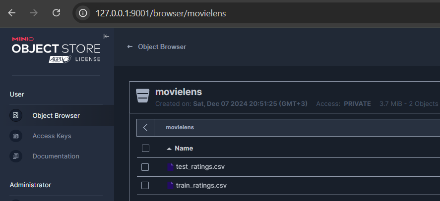

# AIM2024_ML_SYSTEM_DESIGN
## Автор - Николаев О.В. 
Цель - создать стройную воспроизводимую среду для передачи нашего исследования коллеге. Строим модель рекомендаций.

docker compose:

1) Запускает сервис minio
2) Запускает мастер Spark и 3 воркера Spark Запускает все сервисы Airflow

Для Airflow создайте набор DAGs, который:

1) Скачивает и распаковывает данные (https://grouplens.org/datasets/movielens/, датасет  ml-latest.zip )
 
2) Разбивает датасеты по дате оценки на train и test
 
3) Создает бакет movielens в minio.
   
4) Копирует наборы ml-latest в созданный бакет.
   
5) Делает обработку тренировочного датасета на созданном мини-кластере Spark. Создает модель рекомендаций для пользователей.
6) Запускает обработку тестового датасета и предсказания с помощью Apache Spark и pandas_udf.
7) Проверяет полученный результат.

## Start UP

1) Clone repo
2) `echo -e "AIRFLOW_UID=$(ID -u)" > .env`
3) docker-compose up --build -d

## Results

**http://127.0.0.1:9001/**
<!-- #region -->

**http://localhost:9080/** (workers - http://localhost:8081/ http://localhost:8082/ http://localhost:8083/)
<!-- #region -->

**http://localhost:8080/**
<!-- #region -->

